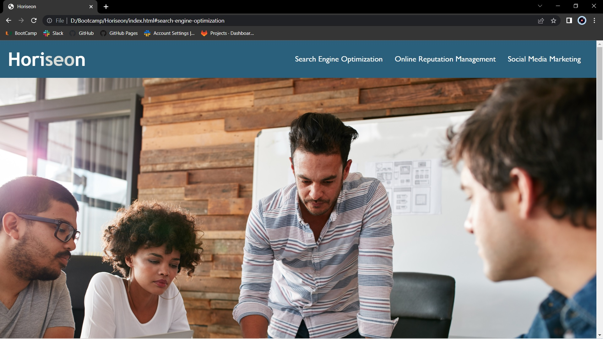
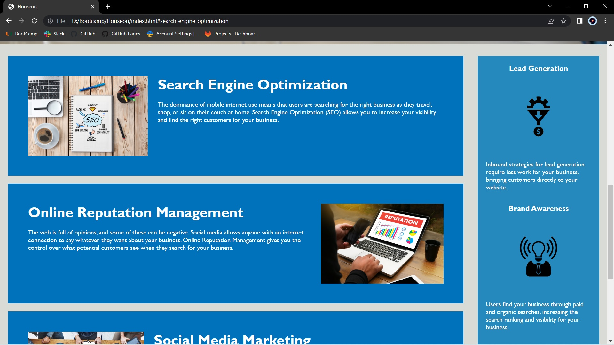
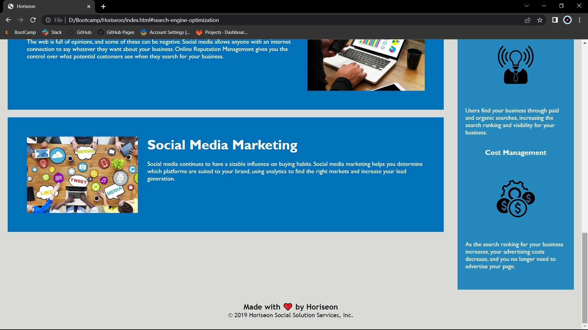

# Horiseon

## License

## Description

Web accesibility is the practice of designing and developing websites and content that can be accessed and used by all individuals, regardless of any disability they may have. This includes individuals with visual, auditory, physical, or cognitive disabilities, as well as those who may be using assistive technologies such as screen readers or voice recognition software. The goal of this project is to remove barriers and provide equal access to information and online services that non-disabeled individuals can enjoy.
### IMPORTANT ADVICE:
This layout is designed for "desktop", so you may notice that some of the elements don't look like the Mock-Up when viewed at a resolution smaller than 768px. In future updates this web application will be optimized for any screen size.

## Deployment Link
https://juliobermudez.github.io/Horiseon/
👆Click Here 👆

## Usage

## Instalation

No dependencies are required to run Horiseon on localhost.

